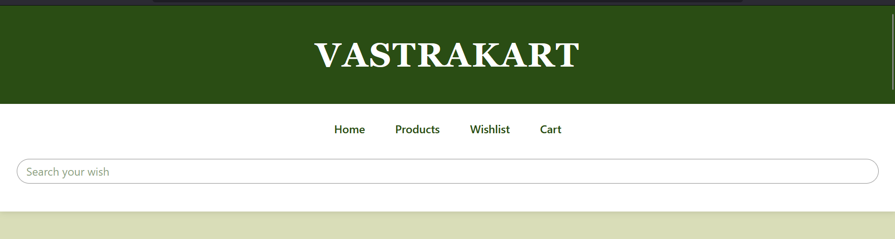
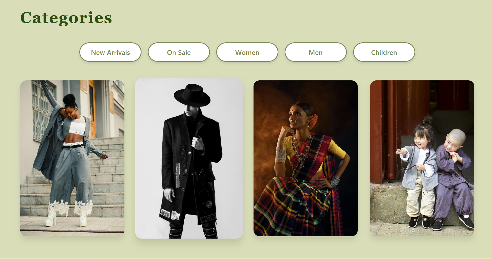
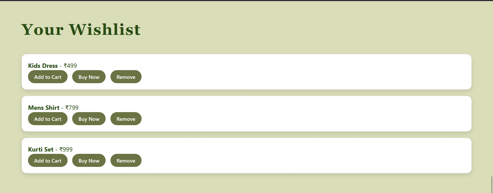
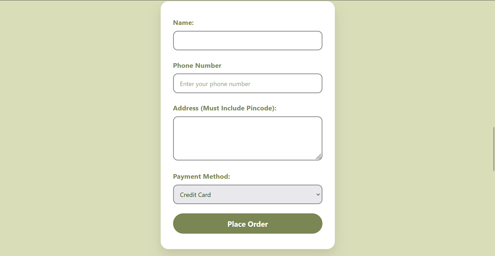

# 🛍️ VastraKart - E-Commerce Fashion Store

**VastraKart** is a modern and responsive e-commerce web application built using **React**. It showcases a beautiful collection of ethnic fashion items like Kurtis, Sarees, and Anarkalis. Designed with a soft **green-gold aesthetic**, the site offers a seamless shopping experience with features like cart and wishlist management, direct purchase, and a dynamic checkout form with validation.

---

## 🚀 Features

- 🌿 Clean UI with custom styling and smooth hover effects
- 🛒 Add to Cart, Wishlist, and Direct Buy functionality
- 📝 Checkout form with validation and order summary
- 🔍 Search, sort, and filter options for products
- 📱 Mobile-friendly and fully responsive design
- 🔁 State persistence using React Context API
- 🎯 Modular and component-based architecture

---

## 🛠️ Tech Stack

- **Frontend:** React, JavaScript, HTML5, CSS3
- **Styling:** Custom CSS with green-gold themed design
- **State Management:** React Context API
- **Form Handling:** Controlled components with validation

---

## 📸 Screenshots

## 📸 Screenshots

### 🖼️ Screenshot 1: Title

### 🖥️ Screenshot 2: Homepage

---

### 🛍️ Screenshot 3: Product Listing Page

---

### 💖 Screenshot 4: Wishlist Page

---

### 🛒 Screenshot 5: Cart Page

---

### 🧾 Screenshot 6: Place Order (Checkout Form)

---

### ✅ Screenshot 7: Order Successfully Placed

---

## 📂 Project Structure
vastrakart-fresh/
├── public/
│ ├── index.html
│ ├── images/ # screenshots
│ └── script.js # Core JS functionalities
├── src/
│ ├── components/
│ │ ├── Navbar.jsx
│ │ ├── ProductList.jsx
│ │ ├── CartPage.jsx
│ │ ├── WishlistPage.jsx
│ │ └── CheckoutForm.jsx
│ ├── context/
│ │ └── StoreContext.js
│ ├── index.css # Global styling
│ ├── App.js # Main component
│ └── index.js # Entry point

